# RAG-Survey

>We are working hard to improve and update, more content will be presented soon. 😊 Stay tuned!

## <a name='News'></a>News

🚀[Apr 2024] **Release [OpenRAG Base](https://openrag.notion.site/Open-RAG-c41b2a4dcdea4527a7c1cd998e763595).** 🔍.


🚀[Jan 2024] **Introduce Modular RAG and RAG Flow.** [[Part Ⅰ]](https://medium.com/@yufan1602/modular-rag-and-rag-flow-part-ⅰ-e69b32dc13a3) [[Part II]](https://medium.com/@yufan1602/modular-rag-and-rag-flow-part-ii-77b62bf8a5d3)

🚀[Dec 2023] **Release [RAG Survey](https://arxiv.org/pdf/2312.10997.pdf).** (last updated Mar 2024）

**Material**：
[[Slide]](assets/RAG_Slide_ENG.pdf)


If you find our survey useful for your research, please cite the following paper:
```
@misc{gao2024retrievalaugmented,
      title={Retrieval-Augmented Generation for Large Language Models: A Survey}, 
      author={Yunfan Gao and Yun Xiong and Xinyu Gao and Kangxiang Jia and Jinliu Pan and Yuxi Bi and Yi Dai and Jiawei Sun and Qianyu Guo and Meng Wang and Haofen Wang},
      year={2024},
      eprint={2312.10997},
      archivePrefix={arXiv},
      primaryClass={cs.CL}
}

```
**Table of Content**

- [OpenRAG Base](#openrag-base)
    - [What  is ?](#what--is-)
    - [Why  do this ?](#why--do-this-)
    - [How to Use ?](#how-to-use-)
    - [Who are we ?](#who-are-we-)
- [RAG](#rag)
  - [What is  RAG ?](#what-is--rag-)
  - [Paradigm of RAG](#paradigm-of-rag)

  - [How to do Augementation ?](#how-to-do-augementation-)
  - [RAG or Fine-tuning ？](#rag-or-fine-tuning-)
  - [How to Evaluate RAG ?](#how-to-evaluate-rag-)
  - [Prospects](#prospects)
- [Contact us](#contact-us)
- [AI-ceping](#AI-ceping)


## <a name='OpenRAGBase'></a>OpenRAG Base

A brand-new form of RAG knowledge base. It will replace the Paper list.🐿️
[Homepage](https://openrag.notion.site/Open-RAG-c41b2a4dcdea4527a7c1cd998e763595)


### <a name='Whatis'></a>What  is ?

Open RAG Knowledge Base is a **Notion** repository of RAG knowledge that is built upon the collection, organization, and aggregation of publicly available resource.  **Maybe the most comprehensive source for RAG information at present**. Including:

- Academic Paper
- Cutting Edge Readings
- Benchmark and Evaluation
- RAG  Scholar and Institution
- Downstream tasks and Dataset
- Toolkit
- …. More content coming soon.(e.g. seminar, baseline, cookbook)

Although more focused on academic research, whether you are just getting started with RAG, are a RAG-related researcher, or are a practitioner, I believe you can benefit from it. 

Based on this repository, you have a highly flexible and dynamically updated survey, and it can  support **highly customizable analysis and summarization .** For example, if you want to see which papers have open-sourced code, which conferences these papers were published in, which papers used the same dataset, in order to quickly compare them.

> 💡 With OpenRAG Base, you will have a RAG knowledge base tailored exclusively for you.


*We will continue to update this project*

### <a name='Whydothis'></a>Why  do this ?

The current conventional practice for organizing survey papers is to list relevant papers through Readme on Github (we used to do this before as well).

However, we find this to be a relatively inefficient and non-intuitive method, including the following points:

- The content is fixed, and users cannot quickly find the corresponding content according to their own needs.
- The waterfall display makes the page too long and looks very redundant.
- It is relatively difficult to update.
- User comments and other interactive methods are more cumbersome.
- Only data collection, lacking analysis and summary.
- Each user sees the same content, unable to provide personalized services.

> 💡 We hope to have a more flexible and intuitive platform that helps users analyze and grasp technological developments, rather than simply stacking up materials.


### <a name='HowtoUse'></a>How to Use ?

If you haven't used Notion before, that's okay, it's very easy to operate ([Official Tutorial](https://www.notion.so)).

The entire knowledge base consists of multiple Notion Databases, with linked relation between the Databases

Click on a specific Database in the Database List on the homepage to view detailed content.
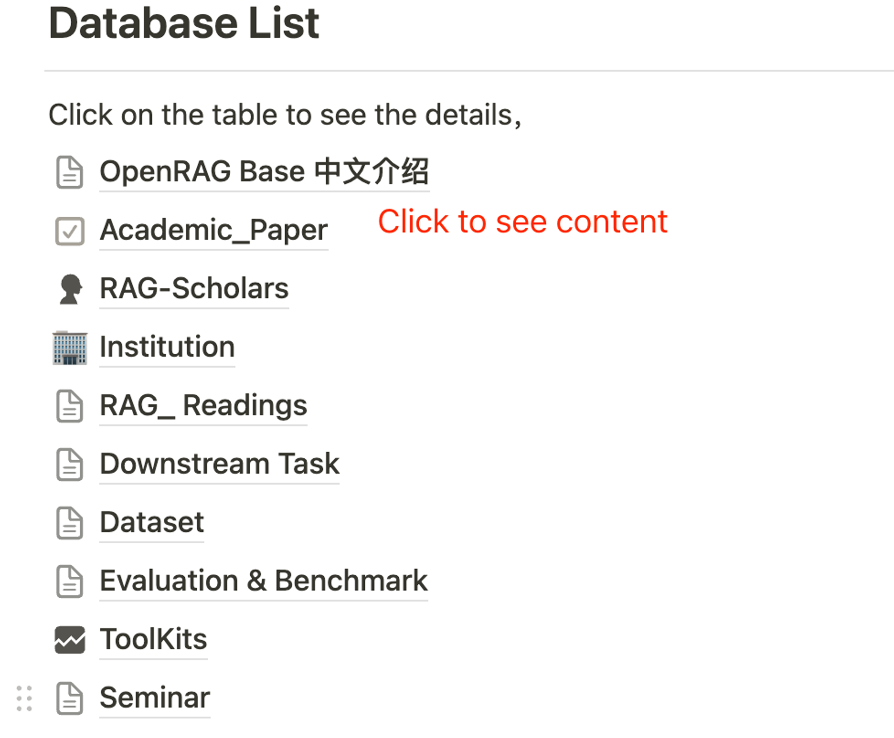
Below, we will introduce each Database individually


> 💡 Note: 
When browsing online, you can only view static pages and cannot make modifications. You need to copy to your local  in order to make changes.
Click "Duplicate" in the top right corner of the homepage (you need to be logged in to Notion).
You can duplicate the entire project or a single page (when duplicating a single page, data associated with other databases will not be displayed).
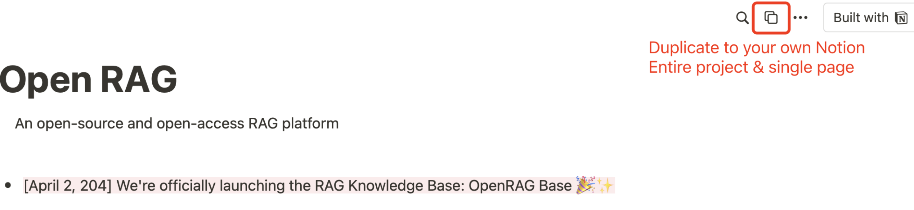


#### <a name='Academic_Paper'></a>Academic_Paper 

This is the main page, which contains academic papers on RAG under the context of large models. We will use this Database as a case study to detail several common methods of using OpenRAG Base.

**Overview**

Each row represents a paper on RAG, and we have designed over ten properties to help with analysis and summarization, with the paper's abbreviation serving as the primary key.

[Understand the concept of Notion Property](https://www.notion.so/help/database-properties)


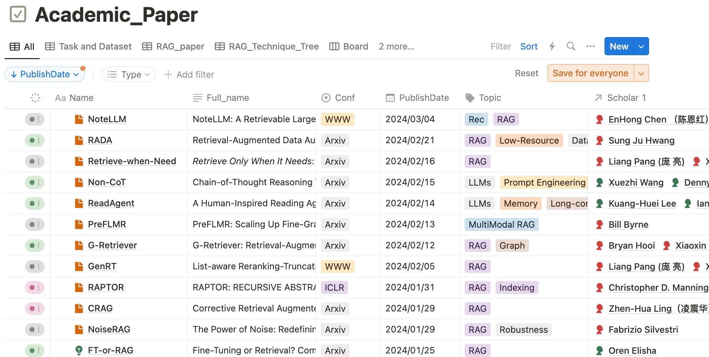
Display the main page of Academic Papers.

**Common operations**
- The control area is located in the upper right corner, where you can filter, sort, and search fields.
- Clicking on '···' opens more controls, where you can select the displayed fields (properties) or group them. The "All" view will display all fields by default, which may contain a lot of redundancy. We will also provide targeted displays in other views, and you can create your own views as well.

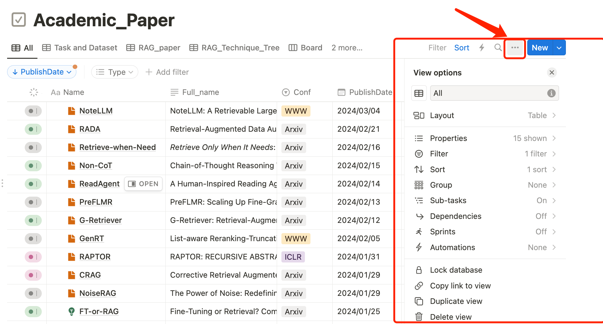

The control area is located in the upper right corner and common operations include: querying, filtering, sorting, displaying fields, and grouping.

**Pages**

This is one of Notion's unique features where each piece of data can be a Page. The paper's abbreviation serves as the primary key, and hovering the mouse next to it will display "Open". Clicking on it will expand the detailed page of the paper on the right. In the upper right corner, you can switch the sidebar to full screen mode for quick scrolling through data.

- The detailed page includes all the attributes of that data.
- It functions as a standalone page where you can record content, images etc.

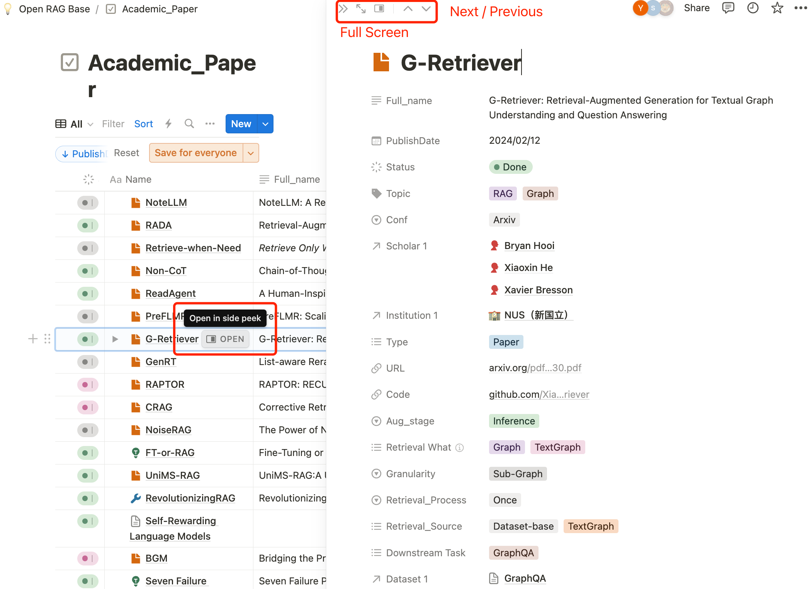


Click on "Open" next to the paper abbreviation on the right to open the detailed page.

In addition to displaying the attributes, for the convenience of readers to quickly understand the paper's content, we have three additional sections on the detailed page:

- Abstract and author information from the original paper
- Important figures and charts from the paper, typically process or model architecture diagrams
- Quick reading (In Chinese)

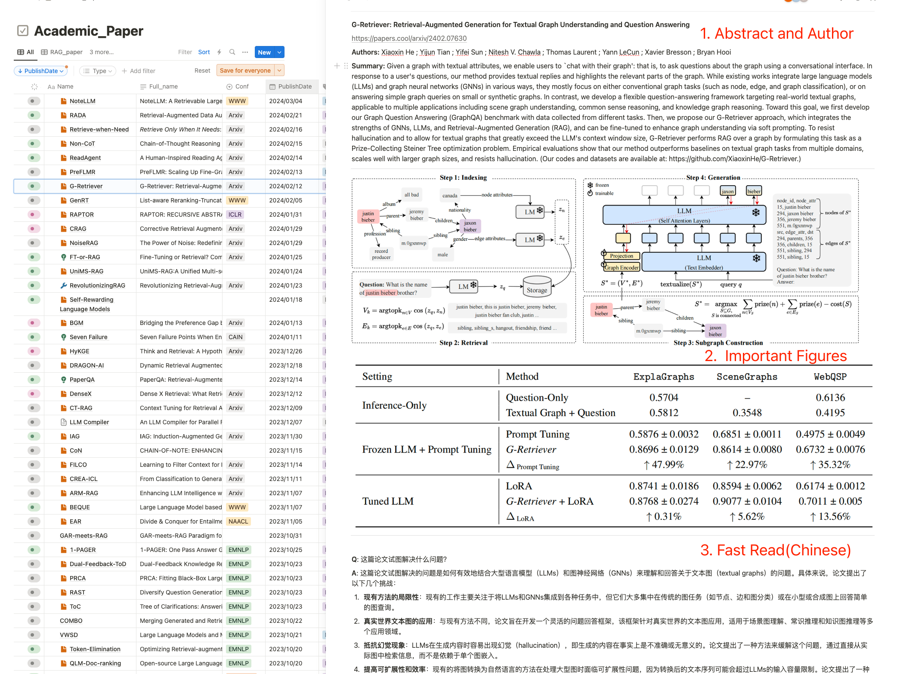

The paper detail page presents a quick interpretation of the original paper. 

The quick reading guide utilizes **[Papers.cool](https://papers.cool)** and **[Kimi Chat](https://kimi.moonshot.cn)** (an excellent LLMs tool for assisting in reading papers 💪).

The address for Papers.cool is right below the paper title, for example: https://papers.cool/arxiv/2402.07630

The usage of Papers.cool is also very simple, for example, you just need to enter the Arxiv id on the website：[https://papers.cool/arxiv/](https://papers.cool/arxiv/2402.07630)<arxiv_id>. 

You can further engage with Kimi Chat by accessing it from the bottom of the webpage.

![On the Papers.cool page, click on [PDF] to open the original paper and click on [KIMI] to generate a quick reading interpretation.](images/OpenRAG_Base/papers_cool.png)

On the Papers.cool page, click on [PDF] to open the original paper and click on [KIMI] to generate a quick reading interpretation.

If you want Kimi to generate an English interpretation, you can use Ctrl/command + F, then select settings, set the Kimi Language to English, don't forget to save, and after refreshing, it will output in English.

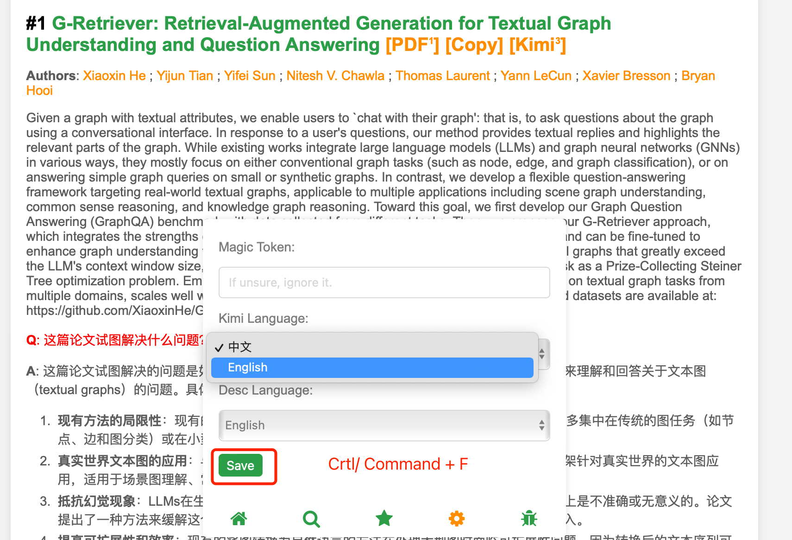

Set the language of the quick reading guide to English,

**Views**

Below the title in the top left corner is the view area, displaying the current list of views.

You can save your custom settings as a view to make the table more targeted and easier to access later.

In addition to tables, views also support formats like boards, timelines, galleries, and more.

For example, if you want to specifically view tasks and datasets in the RAG paper, you can filter out these fields and set corresponding filters. These settings will be displayed below the view.

An example of a view for RAG Tasks and Datasets:


Another commonly used view is the Board view, often used in conjunction with grouping.

For example, if you want to see which papers are related to pre-training, fine-tuning, and inference, you can create a Board view and use "Aug_Stage" as the grouping criteria. You can also select the fields to display, apply filters, and set sorting preferences.

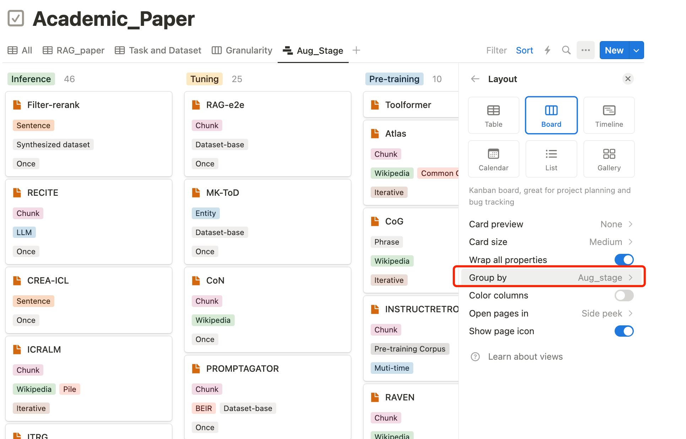

An example of a Board view grouped by the Augmentation Stage

**Relation**

"Relation" is another important concept in Notion. It is represented by an arrow in the properties and can be understood as an attribute that links two databases together. This attribute acts as a regular property in one database and as a primary key in another database.

> [Detailed  Information for Notion “Relation”.](https://www.notion.so/help/relations-and-rollups#what-is-a-database-relation）)

Official Example for “Relation”
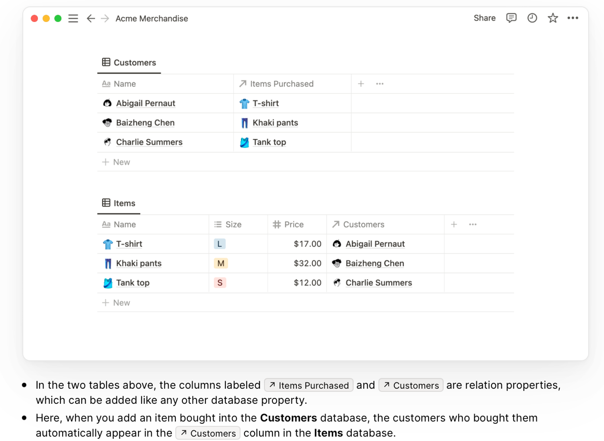


In the OpenRAG Base, we have set up multiple Relation properties such as Scholar, Institution, Dataset, etc. This allows us to conduct more targeted analysis based on these properties. Each property corresponds to a database where it serves as the primary key for linking related information.


“Relation” examples in OpenRAG Base
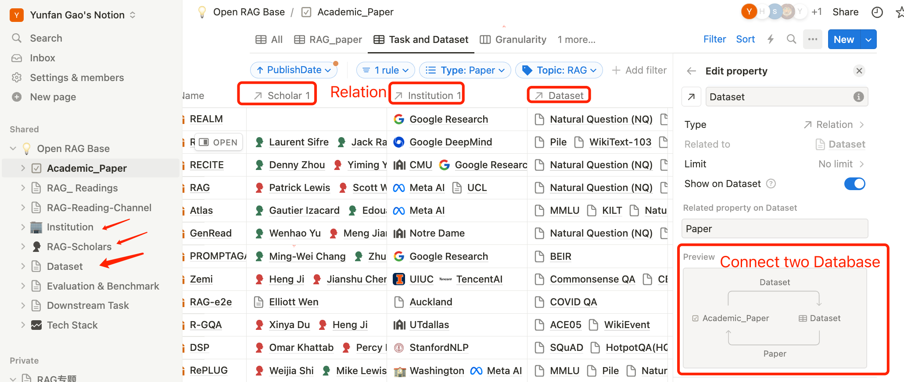

In the example above, there are three Relations. By clicking on the table header and entering "Edit Property", you can see the right sidebar where the "Preview" section displays which two databases are linked by this Relation. 

In the specific example, the Relation is bidirectional, meaning the "Dataset property" appears in the Academic_paper database and links to the Dataset table as a primary key. Conversely, the primary key "Paper" in the Academic_paper database will automatically link to the Dataset table.

Now, let's open the Dataset Database on the right to have a more visual understanding. You will see that a "Paper" Relation property automatically appears in the Dataset database.


> 💡 This means that when you add a dataset to a paper in the Academic_paper database, the "Paper" property in the Dataset table will automatically include  that paper. This bidirectional relation ensures that the information stays connected and updated across databases.


In a bidirectional relation, the Dataset table will automatically link to the primary key (Paper) in the associated table (Academic_paper) and update accordingly. This ensures that the data remains synchronized between the two databases and reflects any changes made in either database.

Below we will briefly introduce other databases, which can be used in the same way as Academic_Paper.

### <a name='DownstreamTaskandDataset'></a>Downstream Task and Dataset


These two databases summarize the downstream tasks and datasets used in the RAG domain. The datasets have been presented in the previous section, and the downstream tasks are summarized as follows:


Downstream Task in Gallery View

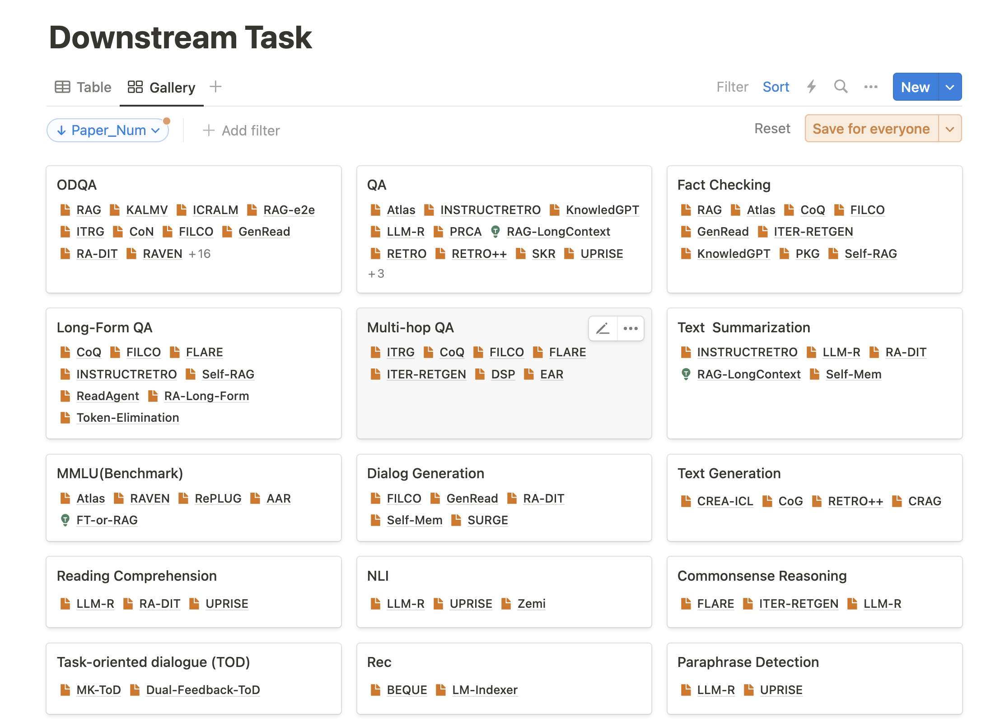

You can also refer to the summary of downstream tasks and datasets in our survey.

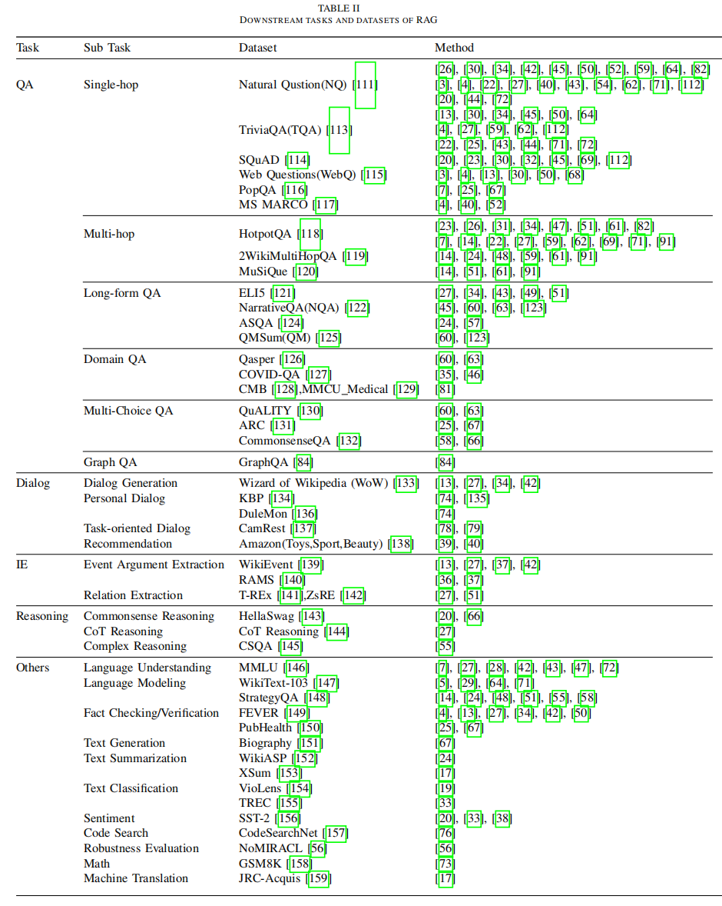


### <a name='RAGReadings'></a>RAG Readings

In addition to academic papers, there are many other channels that can help us access cutting-edge information about RAG.

We have selected some important reading materials related to RAG and placed them in this database, including Medium articles, WeChat articles (In Chinese) , Zhihu articls (In Chinese),  and official blogs of technical frameworks (such as Langchain, LLamaIndex, Neo4j), and YouTube videos.

Since these selections are subjective, they may be influenced by personal impressions. If you come across excellent articles, you can also inform me through comments.

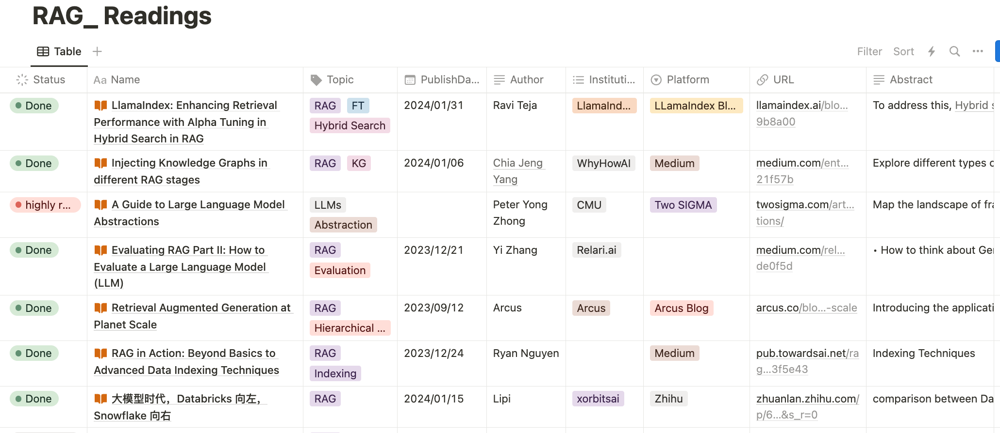


### <a name='RAGScholarandInstitution'></a>RAG Scholar and Institution

Would like to know which individuals and organizations are researching RAG? The Scholar and Institution databases summarize the main researchers and their institutions in the field of RAG based on papers and blogs. For the purpose of statistical analysis, for a single article, we typically only count the first author, corresponding author, or laboratory head.

The following image is our RAG Scholar Gallery, displaying the institutions of relevant authors and their representative works. **Red icons represent researchers in academia, while green icons represent practitioners in the industry. It can be seen that RAG is indeed a direction of great interest in both academia and industry**.

*The "High" label only represents a subjective evaluation of the researcher's relevance to the research direction and RAG (usually a researcher's work involves multiple directions), for reference only, and does not imply any other meaning.*

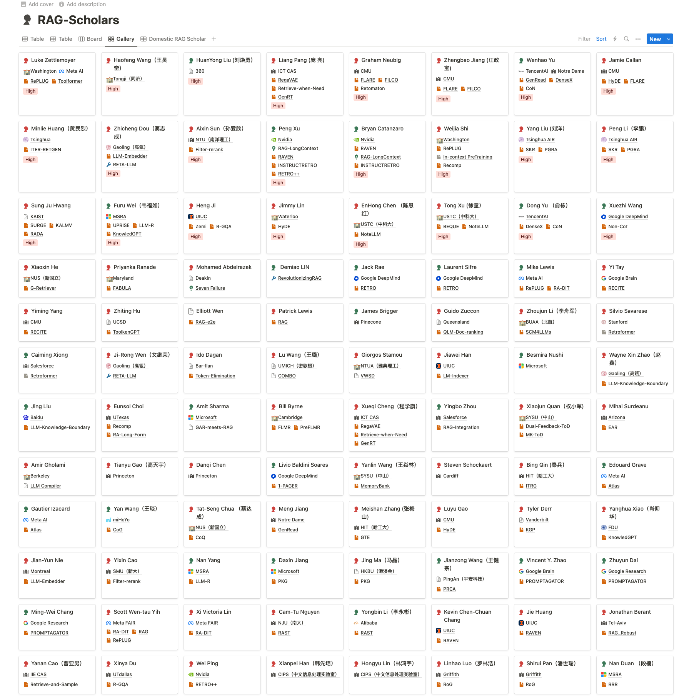


### <a name='EvaluationBenchmarkandToolkit'></a>Evaluation, Benchmark and Toolkit


The evaluation of RAG has always been a very important step. Here we will summarize the current evaluation tools and benchmark tests. And the technology frameworks that we can use when developing the RAG system, such as Langchain, LLamaIndex, etc.


### <a name='Whatelse'></a>What else ？

- Comment：You can comment and engage in friendly discussions on any topic of interest to you, such as Database or Pages details. Please maintain good social etiquette and refrain from discussing topics unrelated to RAG.

- **DUPLICATE！**

💡 Anyone can clone the entire repository to local, and make more flexible modifications.**Start building your own exclusive RAG knowledge base from here!**


- Contribute ：If you are interested in contributing to maintaining this project, please email us !

### <a name='Whoarewe'></a>Who are we ?

This project is jointly initiated by 

- Haofen Wang (王昊奋) 、Meng Wang (王萌) ,**Tongji University**
- Yun Xiong (熊贇) Shanghai Key Laboratory of Data Science, **Fudan University**


# RAG

## <a name='WhatisRAG'></a>What is  RAG ?

Large language models (LLMs) have become an integral part of our lives and work, transforming how we interact with information through their astonishing versatility and intelligence.

Despite their impressive capabilities, they are not without flaws. These models can produce misleading "**hallucinations**," rely on potentially **outdated information**, be inefficient when dealing with **specific knowledge**, lack depth in **specialized fields**, and fall short in reasoning abilities.

In real-world applications, data needs to be continually updated to reflect the latest developments, and the content generated must be transparent and traceable to manage costs and protect data privacy. Therefore, relying solely on these "**black box**" models is insufficient; we need more refined solutions to meet these complex demands.

In this context, **Retrieval-Augmented Generation (RAG)** has risen to prominence as a groundbreaking trend in the age of artificial intelligence.


>  A typical application of RAG in question-answering. (e.g. Asking chatGPT about the dismissal and rehirement of OpenAI CEO SAM Altman :satisfied: )

RAG significantly improves the precision and pertinence of content by first **retrieve relevant information** from an **external database** of documents prior to the language model's answer generation. 

## <a name='ParadigmofRAG'></a>Paradigm of RAG 

RAG concept, introduced by Lewis in 2020, has rapidly evolved, marking distinct stages in its research journey. Initially, the research aimed to bolster language models by infusing them with additional knowledge during the **pre-training phase**. The launch of ChatGPT sparked a heightened interest in leveraging large models for in-depth contextual understanding, accelerating RAG's development **in inference stage**. As researchers delved deeper into the capabilities of large language models (LLMs), the focus shifted toward enhancing their controllability and reasoning skills to keep pace with growing demands. The advent of GPT-4 marked a significant milestone, revolutionizing RAG with a novel approach that blends it with **fine-tuning techniques** while continuing to refine pre-training strategies.

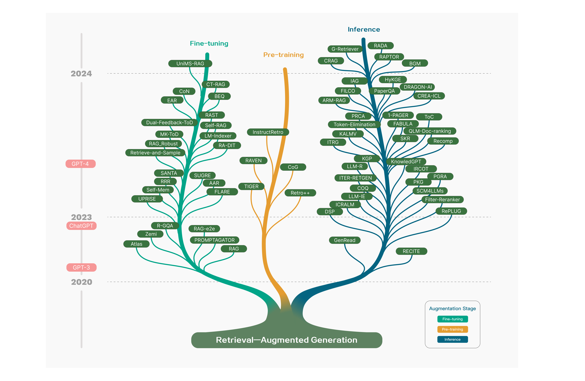

> Technology tree of RAG  research

In the technological development of RAG, we summarize its evolution from the perspective of technological paradigms into the following stages:

### <a name='NaiveRAG'></a>Naive RAG

The classic RAG process, also known as Naive RAG, is demonstrated in the previous example. It mainly includes three basic steps:

1. **Indexing** -Splitting the document corpus into shorter chunks and building a vector index through an encoder.
2. **Retrieval** - Retrieving relevant document fragments based on the similarity between the question and the chunks.
3. **Generation** - Generating an answer to the question conditioned on the retrieved context.

### <a name='AdvancedRAG'></a>Advanced RAG

Naive RAG faces multiple challenges in retrieval, generation and augmentation. The Advanced RAG paradigm was subsequently proposed and involves additional processing in **Pre-Retrieval**  and **Post-Retrieval**. Before retrieval, methods such as **query rewriting, routing, and expansion** can be used to align the semantic differences between questions and document chunks. After retrieval, **rerank** the retrieved document corpus can avoid the "Lost in the Middle" phenomenon, or the context can be filtered and **compressed** to shorten the window length.

### <a name='ModularRAG'></a>Modular RAG
With the further development and evolution of RAG technology, new breakthroughs have transcended the traditional Naive RAG **Retrieval-Generation framework**, leading to the concept of Modular RAG. Structurally, it is more free and flexible, introducing more specific functional modules, such as query search engines and the fusion of multiple answers. Technologically, it integrates retrieval with fine-tuning, reinforcement learning, and other techniques. In terms of process, the RAG modules are designed and orchestrated, resulting in various RAG patterns. 

However, Modular RAG did not emerge suddenly; there is a relationship of inheritance and development among the three paradigms. Advanced RAG is a special case of Modular RAG, while Naive RAG is a special case of Advanced RAG.

Comparsion between three RAG paradigms.

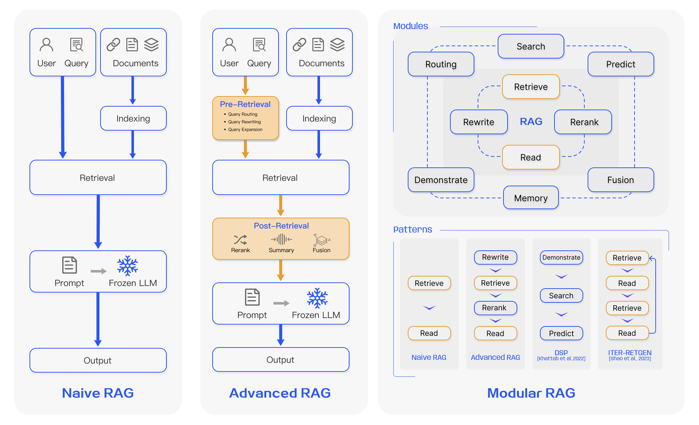

Modular RAG Framework

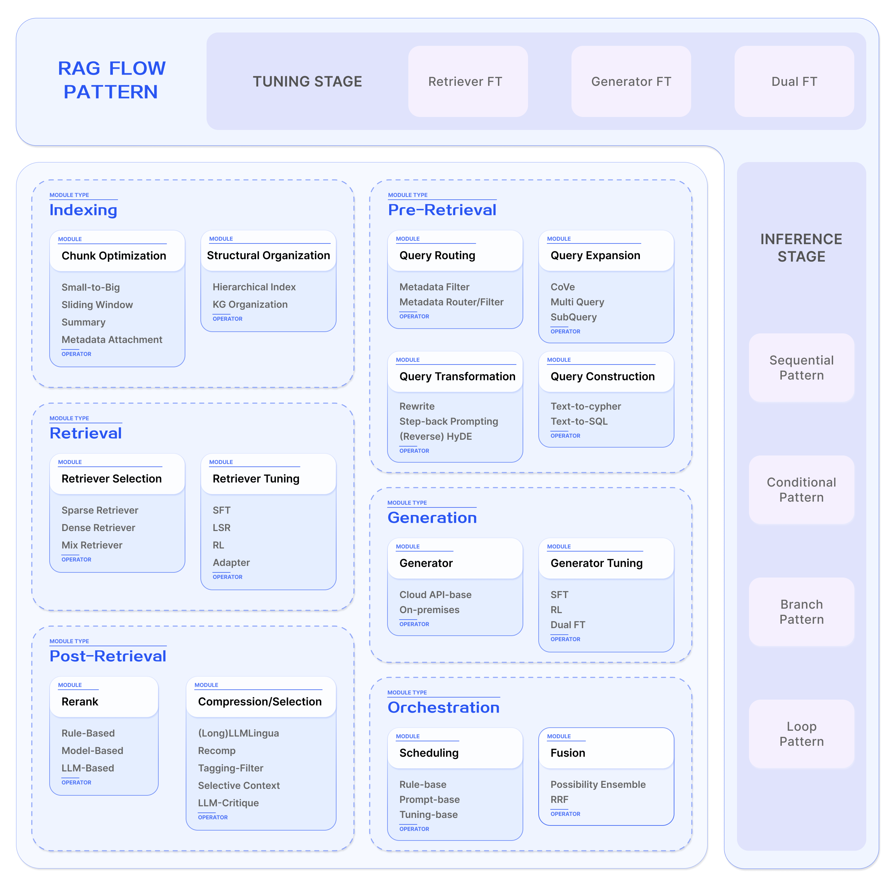

Modular RAG Technical Map
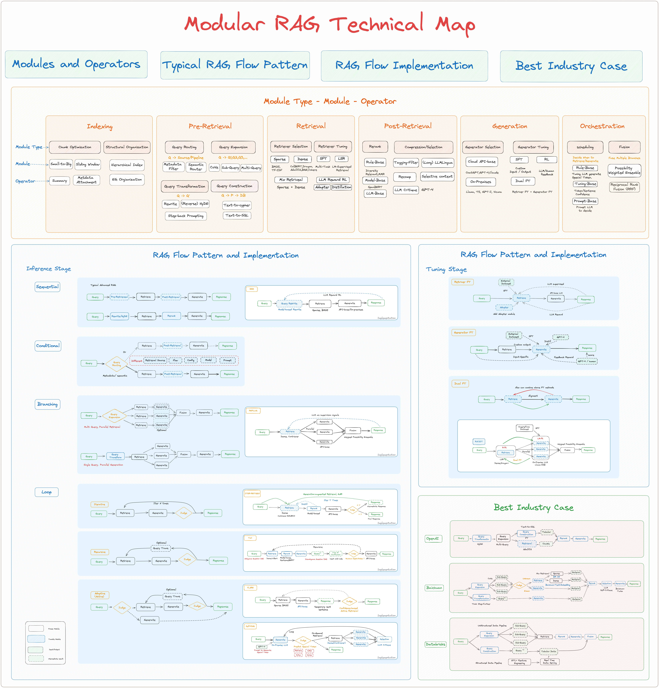


## <a name='HowtodoAugementation'></a>How to do Augementation ?

To build a good RAG system, where the augmentation part is key, three critical questions need to be considered: 

1. What to retrieve? 
2. When to retrieve? 
3. How to use the retrieved content?

Starting from the above three questions, we organize the augmentation as follow:

- **Augmentation Stages**. Retrieval augmentation can be performed during the **pre-training**, **fine-tuning**, and **inference** stages, which determines the degree of parameterization of external knowledge and corresponds to different computational resources required.

- **Augmentation Sources**. Augmentation can utilize various forms of data, including **unstructured data** such as text paragraphs, phrases, or individual words. S**tructured data** can also be used, such as indexed documents, triple data, or subgraphs. Another approach is not to rely on external information sources but to fully leverage the intrinsic capabilities of LLMs, retrieving from **content generated by LLMs** themselves.

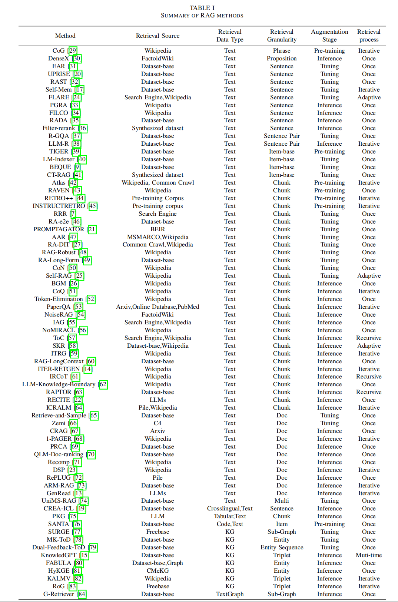

- **Augementation process**. The initial retrieval was a **once** process, but **iterative** retrieval, **recursive** retrieval, and **adaptive** retrieval methods, where LLMs decide the timing of retrieval on their own, gradually emerged in the development of RAG.

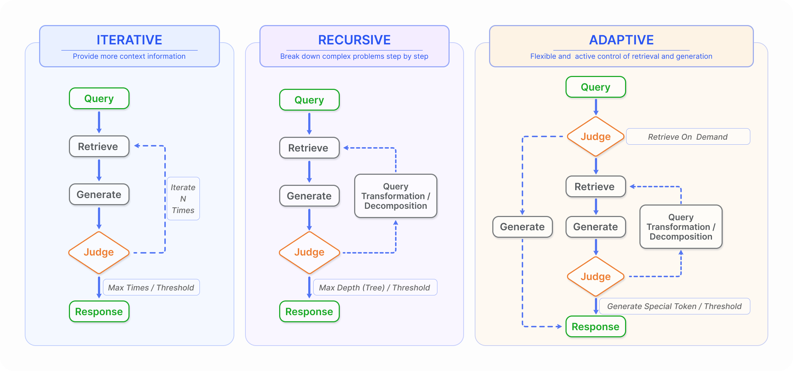


## <a name='RAGorFine-tuning'></a>RAG or Fine-tuning ？

In addition to RAG, the main optimization strategies for LLMs also include Prompt Engineering and Fine-tuning (FT). Each has its own unique features. Depending on their reliance on external knowledge and requirements for model adjustment, they each have suitable scenarios.

RAG is like giving the model a textbook for customized information retrieval, which is very suitable for specific queries. On the other hand, FT is like a student internalizing knowledge over time, better suited for mimicking specific structures, styles, or formats. FT can improve the model's performance and efficiency by enhancing the base model's knowledge, adjusting outputs, and teaching complex instructions. However, it is not adept at integrating new knowledge or rapidly iterating new use cases. RAG and FT are not mutually exclusive; they are complementary, and **using them together may yield the best results.**


> RAG vs Fine-tuning quadrantal diagram

## <a name='HowtoEvaluateRAG'></a>How to Evaluate RAG ?

Downstream Tasks and Dataset:

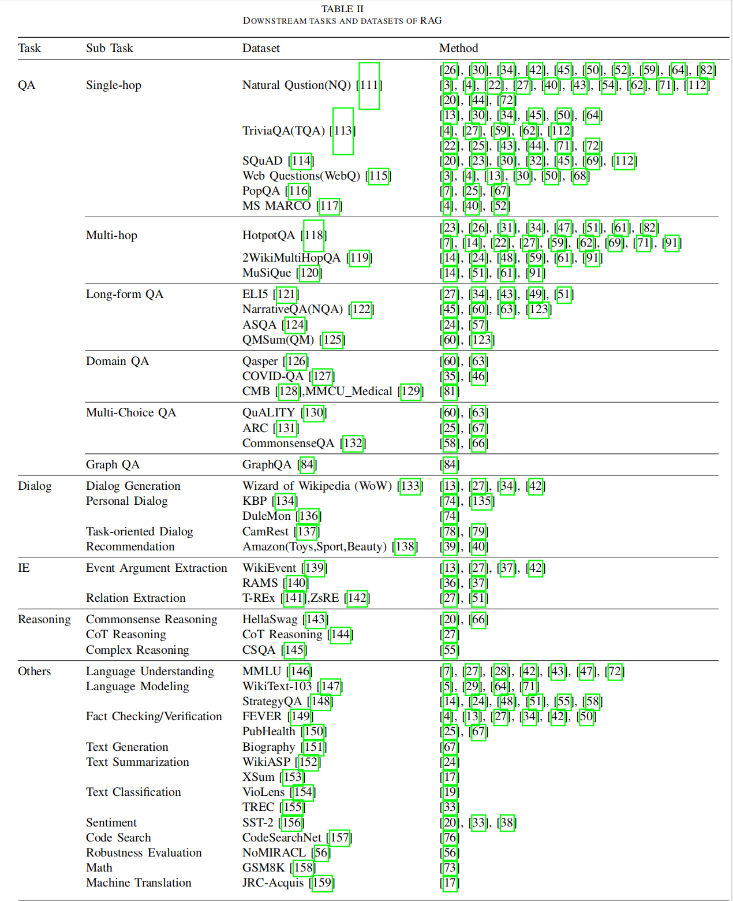

The evaluation methods for RAG are diverse, mainly including three quality scores: **context relevance**, **answer fidelity**, and **answer relevance**. Additionally, the evaluation involves four key capabilities: noise robustness, refusal ability, information integration, and counterfactual robustness. These evaluation dimensions combine traditional quantitative metrics with specialized assessment criteria for RAG's characteristics, although these criteria have not yet been standardized.

In terms of evaluation frameworks, there are benchmarks such as RGB and RECALL, as well as automated evaluation tools like RAGAS, ARES, and TruLens, which help to comprehensively measure the performance of RAG models. 

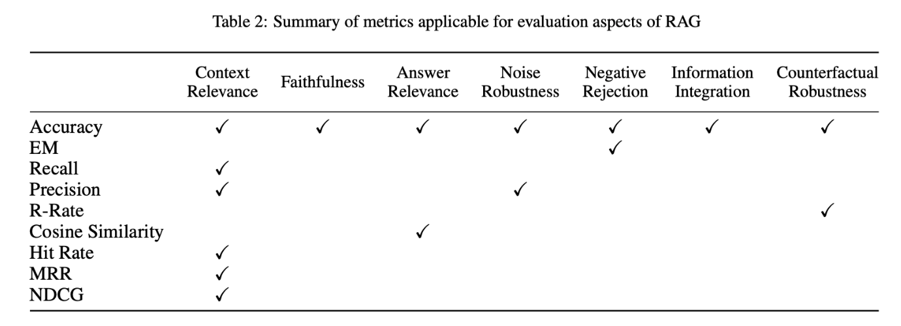

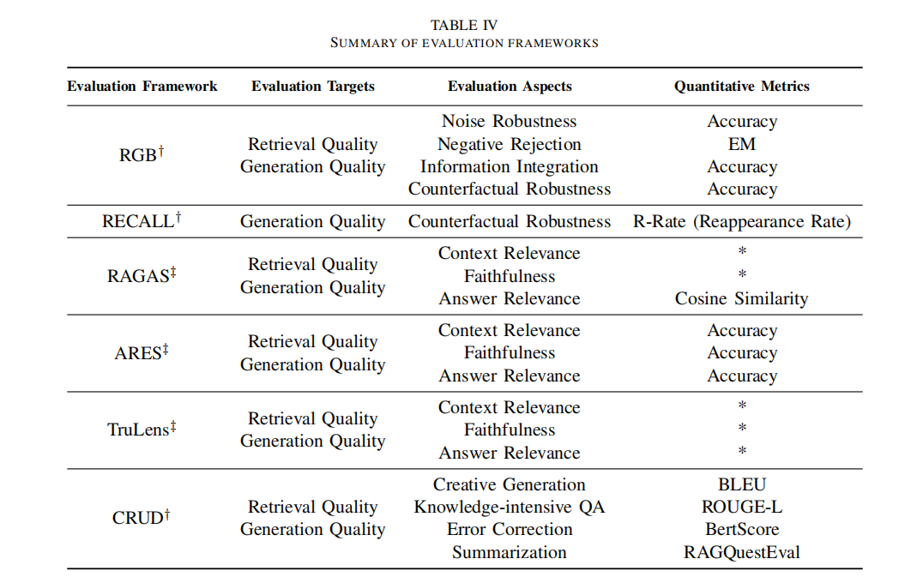

## <a name='Prospects'></a>Prospects

The development of RAG is burgeoning, and there are several issues worth further investigation. We can look forward to these from three aspects:

### <a name='ExstingChallenges'></a>Exsting Challenges

Aiming to further address the current challenges faced by RAG;

- **Context length.** What to do when the retrieved content is too much and exceeds the window limit? If the context window of LLMs is no longer limited, how should RAG be improved?
- **Robustness**. How to deal with incorrect content retrieved? How to filter and validate the retrieved content? How to enhance the model's resistance to poisoning and noise?
- **Coordination with fine-tuning**. How to leverage the effects of both RAG and FT simultaneously, how should they coordinate, organize, whether in series, alternation, or end-to-end?
- **Scaling Laws**: Does the RAG model satisfy the Scaling Law? Will RAG, or under what scenarios might RAG experience the phenomenon of Inverse Scaling Law?
- **The role of LLMs**. LLMs can be used for retrieval (replacing search with LLMs' generation or searching LLMs' memory), for generation, for evaluation. How to further explore the potential of LLMs in RAG?
- **Production-ready.** How to reduce the retrieval latency of ultra-large-scale corpora? How to ensure that the content retrieved is not leaked by LLMs

### <a name='MultimodalExpansion'></a>Multimodal Expansion 

How can the evolving technologies and concepts of RAG be extended to other modalities of data such as **images, audio, video, or code**? On the one hand, this can enhance tasks within a single modality, and on the other hand, it can fuse multimodalities through the ideas of RAG.

### <a name='TheEcosystemofRAG'></a>The Ecosystem of RAG
The application of RAG is no longer confined to question-answering systems; its influence is expanding into more domains. Now, a variety of tasks such as r**ecommendation systems, information extraction**, and **report generation** are beginning to benefit from the application of RAG technology.

 At the same time, the RAG technology stack is experiencing a boom. In addition to well-known tools like **Langchain** and **LlamaIndex**, the market is seeing an emergence of more targeted RAG tools, for example: those **customized** for specific use cases to meet more focused scenario requirements; those **simplified** for use to further lower the barrier to entry; and those specialized in functionality, gradually aiming towards **production environments.**

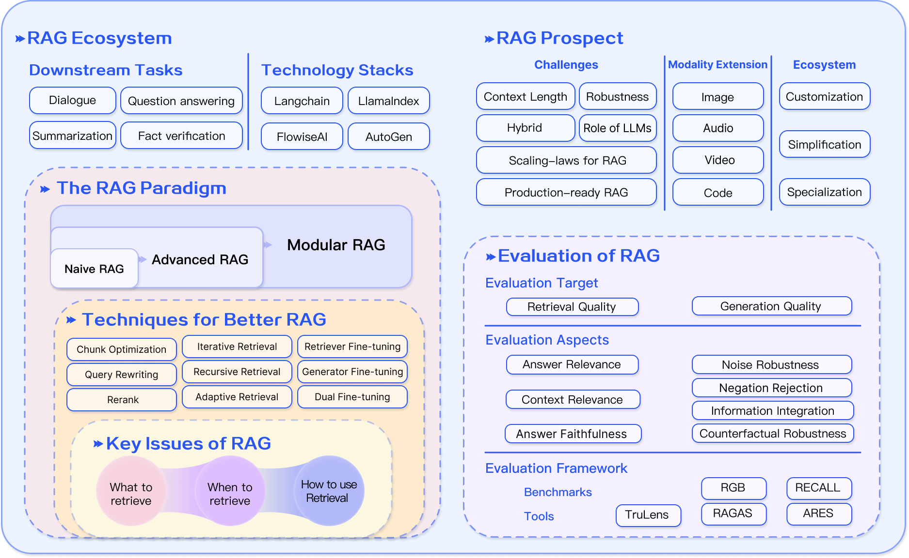


### <a name='RAGPaperList'></a>RAG Paper List
Check OpenRAG Base

10.KAUCUS: Knowledge Augmented User Simulators for Training Language Model Assistants[[paper]](https://aclanthology.org/2024.scichat-1.5.pdf)


### <a name='Contactus'></a>Contact us

For questions and suggestions about this project, please contact:

- **Yunfan Gao** (高云帆）

Shanghai Research Institute for Intelligent Autonomous Systems (Tongji University) ,PhD Candidate, Email: [gaoyunfan1602@gmail.com](mailto:gaoyunfan1602@gmail.com)

For collaboration and other related matters, please contact:

- **Haofen Wang(王昊奋)** Tongji University ****  Email: [haofen.wang@tongji.edu.cn](mailto:haofen.wang@tongji.edu.cn)
- **Meng Wang(王萌)** Tongji University   Email: [mengwangtj@tongji.edu.cn](mailto:mengwangtj@tongji.edu.cn)
- **Yun Xiong(熊贇)**   Fudan University Email: [yunx@fudan.edu.cn](mailto:yunx@fudan.edu.cn)


## <a name='MISC'></a>MISC

### <a name='AI-ceping'></a>AI-ceping

  Our LLMs evaluation project: [AI-Ceping](https://ai-ceping.com)
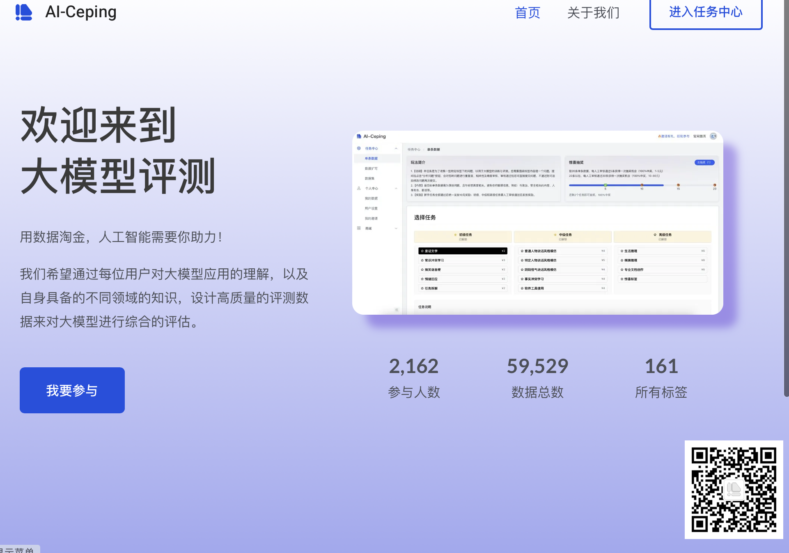


**Visualization**

We're incredibly thankful for the warm reception and positive feedback we've received regarding the figures in the survey. It's always a pleasure to share insights from our corner of the data visualization world.

Our go-to tool for creating these visuals is [Figma](https://www.figma.com/). We're currently in the midst of refining our charts, ensuring they are as informative and user-friendly as possible.

With an eye toward the future and a commitment to the spirit of collaboration, we're also exploring the possibility of releasing our chart templates as open-source template in Figma. Keep an eye on the repo for updates on this exciting initiative


## <a name='Acknowledgments'></a>Acknowledgments


We would like to extend our deepest gratitude to the following authors and researchers. Their exceptional contributions in the field of RAG, along with their willingness to share their findings, have been truly commendable.Without their insightful research, invaluable experience, and generous sharing, we would not have been able to present the material associated with RAG as extensively in our survey. We reiterate our profound appreciation to all the researchers, industry professionals, and knowledge sharers. Additionally, we extend our thanks to everyone who has provided us with invaluable insights.


