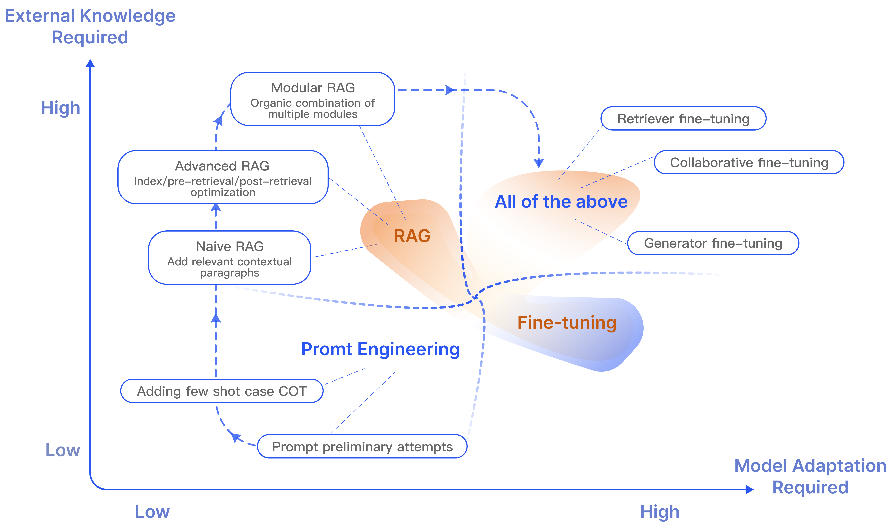
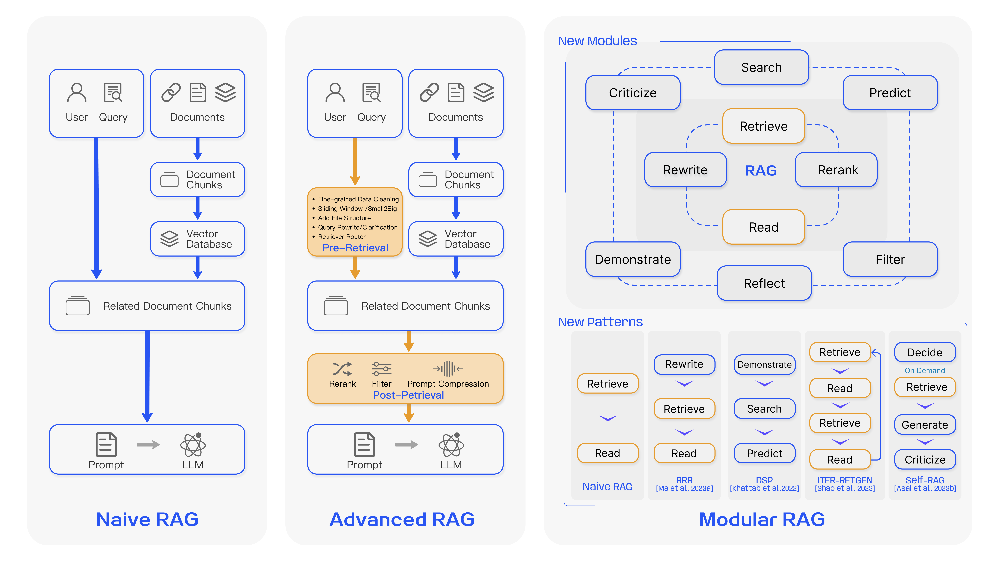
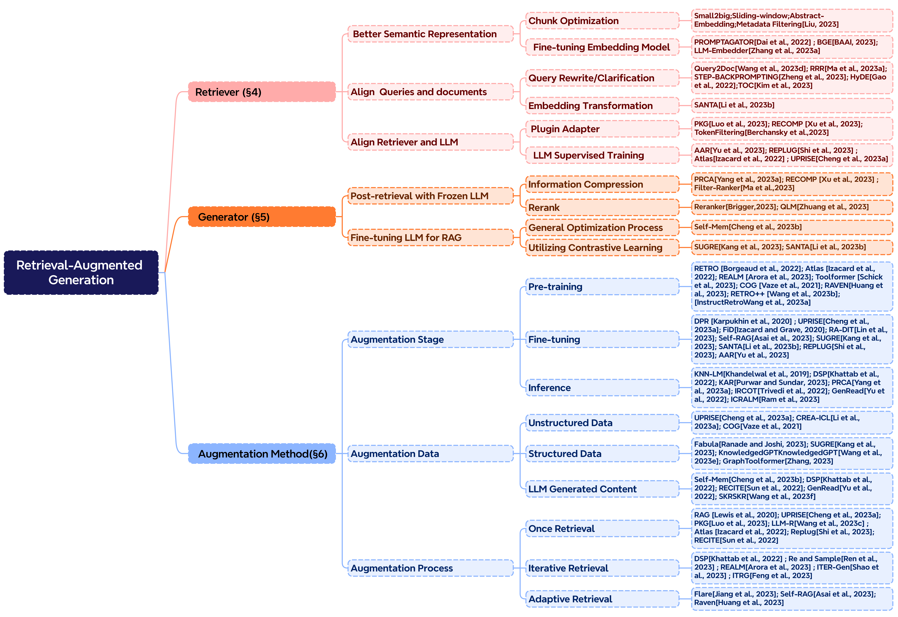

# RAG-Survey
---

**🚀(New) [18 Dec 2023] We release the RAG Survey on arXiv**
**["Retrieval-Augmented Generation for Large Language Models: A Survey"](https://arxiv.org/pdf/2312.10997.pdf)**


---
If you find our survey useful for your research, please cite the following paper:
```
@article{RAGSurvey,
      title={Retrieval-Augmented Generation for Large Language Models: A Survey}, 
      author={Yunfan Gao and Yun Xiong and Xinyu Gao and Kangxiang Jia and Jinliu Pan and Yuxi Bi and Yi Dai and Jiawei Sun and Meng Wang and Haofen Wang},
      year={2023},
    journal={arXiv preprint arXiv:2312.10997},
    url={http://arxiv.org/abs/2312.10997}
}
```


## Timeline of RAG
---


## RAG vs Fine-tuning
---


##  Paradigm of RAG 
---


##  Taxonomy of Core Components
---


# Table of Contents
---

## Augmentation Stage
---
### Pre-training
1.Improving language models by retrieving from trillions of tokens  [[paper]](https://markdown.com.cn)[[code]](https://markdown.com.cn)

2.Few-shot Learning with Re-trieval Augmented Language Models [[paper]](https://arxiv.org/pdf/2208.03299.pdf)

3.Toolformer: Language Models Can Teach Themselves to Use Tools[[paper]](https://arxiv.org/abs/2302.04761)

4.Copy is all you need[[paper]](https://openreview.net/pdf?id=CROlOA9Nd8C)

5.In-context learning with retrieval augmented encoder-decoder language model[[paper]](https://arxiv.org/abs/2308.07922)

6.Shall we pretrain autoregressive language models with retrieval?[[paper]](https://arxiv.org/abs/2304.06762)

7.Demonstrate-Search-Predict: Composing retrieval and language models for knowledge-intensive NLP[[paper]](https://arxiv.org/abs/2212.14024)

### Fine-tuning
1.Dense Passage Retrieval for Open-Domain Question Answering[[paper]](https://arxiv.org/abs/2004.04906)

2.UPRISE: Universal Prompt Retrieval for Improving Zero-Shot Evaluation[[paper]](https://arxiv.org/abs/2303.08518)[[code]](https://github.com/microsoft/LMOps)

3.Distilling knowledge from reader to retriever for question answering[[paper]](https://arxiv.org/abs/2012.04584)

4.RA-DIT: Retrieval-Augmented Dual Instruction Tuning[[paper]](https://arxiv.org/abs/2310.01352)

5.Self-RAG: Learning to Retrieve, Generate, and Critique through Self-Reflection[[paper]](https://arxiv.org/abs/2310.11511)

6.Knowledge Graph-Augmented Language Models for Knowledge-Grounded Dialogue Generation[[paper]](https://arxiv.org/abs/2305.18846)

7.Structure-Aware Language Model Pretraining Improves Dense Retrieval on Structured Data [[paper]](https://aclanthology.org/2023.findings-acl.734.pdf) [[code]](https://github.com/OpenMatch/SANTA)

8.Replug: Retrieval-augmented black-box language models [[paper]](https://arxiv.org/pdf/2301.12652.pdf)

9.Augmentation-Adapted Retriever Improves Generalization of Language 
Models as Generic Plug-In [[paper]](https://arxiv.org/abs/2305.17331)[[code]](https://github.com/OpenMatch/Augmentation-Adapted-Retriever)


### Inference
1.Generalization through Memorization: Nearest Neighbor Language Models[[paper]](https://arxiv.org/abs/1911.00172)

2.DEMONSTRATE–SEARCH–PREDICT: 
Composing retrieval and language models for knowledge-intensive NLP  [[paper]](https://arxiv.org/abs/2212.14024)[[code]](https://github.com/stanfordnlp/dspy)

3.Keyword Augmented Retrieval: Novel framework for Information Retrieval integrated with speech interface. [[paper]](https://arxiv.org/abs/2310.04205)

4.Interleaving retrieval with chain-of-thought reasoning for knowledge-intensive multi-step questions. [[paper]](https://arxiv.org/pdf/2212.10509.pdf)[[code]](https://github.com/stonybrooknlp/ircot)

5.Generate rather than Retrieve: Large Language Models are Strong Context Generators [[paper]](https://arxiv.org/abs/2209.10063) [[code]](https://github.com/wyu97/GenRead)

6.In-Context Retrieval-Augmented Language Models [[paper]](https://arxiv.org/abs/2302.00083)

## Augmentation Data 
---
### Unstructured Data
1.UPRISE: Universal Prompt Retrieval for Improving Zero-Shot Evaluation[[paper]](https://arxiv.org/abs/2303.08518)[[code]](https://github.com/microsoft/LMOps)

2.From Classification to Generation: Insights into Crosslingual Retrieval Augmented ICL [[paper]](https://arxiv.org/abs/2311.06595)

3.Copy is all you need [[paper]](https://openreview.net/pdf?id=CROlOA9Nd8C)

### Structured Data
1.FABULA: Intelligence Report Generation Using Retrieval-Augmented Narrative Construction [[paper]](https://arxiv.org/abs/2310.13848)

2.Knowledge Graph-Augmented Language Models for Knowledge-Grounded Dialogue Generation [[paper]](https://arxiv.org/abs/2305.18846)

3.KnowledGPT: Enhancing Large Language Models with Retrieval and Storage Access on Knowledge Bases [[paper]](https://arxiv.org/abs/2308.11761)

4.Graph-ToolFormer: To Empower LLMs with Graph Reasoning Ability via Prompt Augmented by ChatGPT [[paper]](https://arxiv.org/abs/2304.11116)

### LLM Generated Content
1.Lift Yourself Up: Retrieval-augmented Text Generation with Self-Memory [[paper]](https://arxiv.org/abs/2305.02437)

2.DEMONSTRATE–SEARCH–PREDICT: 
Composing retrieval and language models for knowledge-intensive NLP [[paper]](https://arxiv.org/abs/2212.14024)

3.Recitation-augmented language models[[paper]](https://arxiv.org/pdf/2210.01296.pdf)

4.Generate rather than Retrieve: Large Language Models are Strong Context Generators [[paper]](https://arxiv.org/abs/2209.10063)

5.Self-Knowledge Guided Retrieval Augmentation for Large Language Models [[paper]](https://arxiv.org/abs/2310.05002)


## Augmentation Process
---
### Once Retrieval
1.Retrieval-augmented generation for knowledge-intensive nlp tasks [[paper]](https://proceedings.neurips.cc/paper/2020/hash/6b493230205f780e1bc26945df7481e5-Abstract.html)

2.UPRISE: Universal Prompt Retrieval for Improving Zero-Shot Evaluation [[paper]](https://arxiv.org/abs/2303.08518)

3.Augmented Large Language Models with Parametric Knowledge Guiding [[paper]](https://arxiv.org/abs/2305.04757)

4.Learning to Retrieve In-Context Examples for Large Language Models.[[paper]](https://arxiv.org/pdf/2307.07164.pdf)

5.Few-shot Learning with Re-trieval Augmented Language Models [[paper]](https://arxiv.org/pdf/2208.03299.pdf)
6.Replug: Retrieval-augmented black-box language models [[paper]](https://arxiv.org/pdf/2301.12652.pdf)

7.Recitation-augmented language models[[paper]](https://arxiv.org/pdf/2210.01296.pdf)


### Iterative Retrieval 
1.DEMONSTRATE–SEARCH–PREDICT: 
Composing retrieval and language models for knowledge-intensive NLP [[paper]](https://arxiv.org/abs/2212.14024)[[code]](https://github.com/stanfordnlp/dspy)

2.Retrieve-and-Sample: Document-level Event Argument Extraction via Hybrid Retrieval Augmentation [[paper]](https://aclanthology.org/2023.acl-long.17/)

3.Enhancing Retrieval-Augmented Large Language Models with Iterative Retrieval-Generation Synergy[[paper]](https://arxiv.org/abs/2305.15294)

4.RETRIEVAL-GENERATION SYNERGY AUGMENTED LARGE LANGUAGE MODELS [[paper]](https://arxiv.org/abs/2310.05149)


### Adaptive Retrieval
1.Active Retrieval Augmented Generation[[paper]](https://arxiv.org/abs/2305.06983)[[code]](https://github.com/jzbjyb/FLARE)

2.Self-RAG: Learning to Retrieve, Generate, and Critique through Self-Reflection [[paper]](https://arxiv.org/abs/2310.11511)

3.In-context learning with retrieval augmented encoder-decoder language model [[paper]](https://arxiv.org/abs/2308.07922)


## Acknowledgments
---
We would like to extend our deepest gratitude to the following authors and researchers. Their exceptional contributions in the field of RAG, along with their willingness to share their findings, have been truly commendable. Their exemplary work has profoundly inspired us and provided us with the necessary resources to compile and summarize the pertinent research on RAG in our survey.

- [Jerry Liu](https://jerryjliu.github.io)
- [Danqi Chen](https://acl2023-retrieval-lm.github.io)
- [Huanyong Liu](https://liuhuanyong.github.io)

Without their insightful research, invaluable experience, and generous sharing, we would not have been able to present the material associated with RAG as extensively in our survey. We reiterate our profound appreciation to all the researchers, industry professionals, and knowledge sharers referenced above. Additionally, we extend our thanks to everyone who has provided us with invaluable insights.


