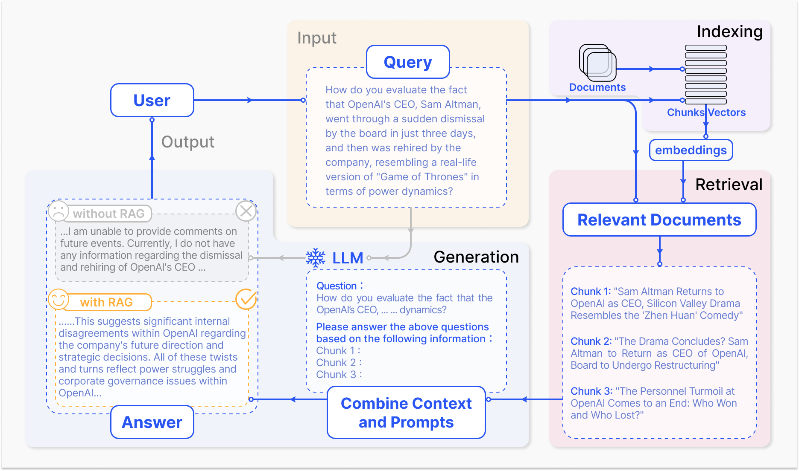
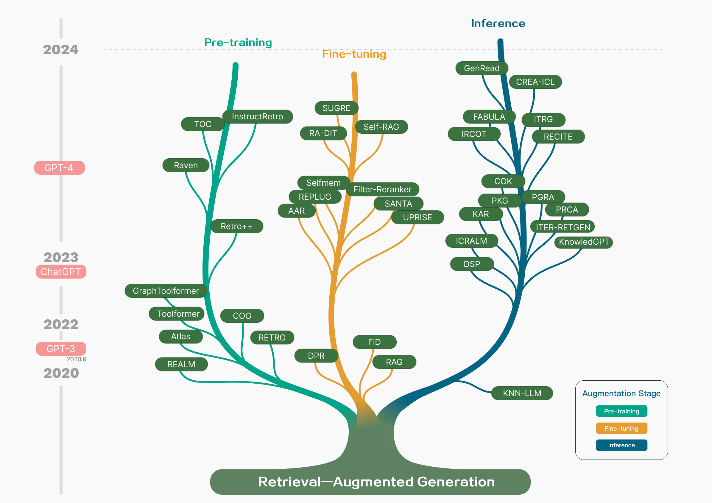
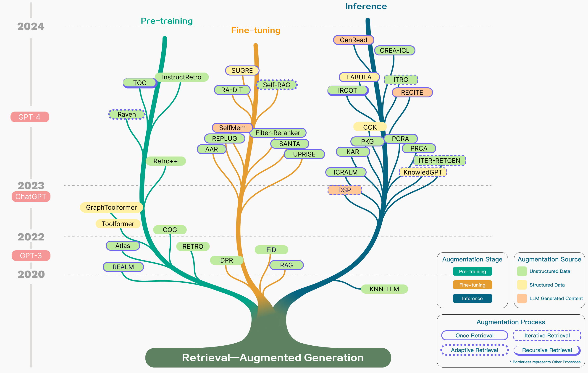
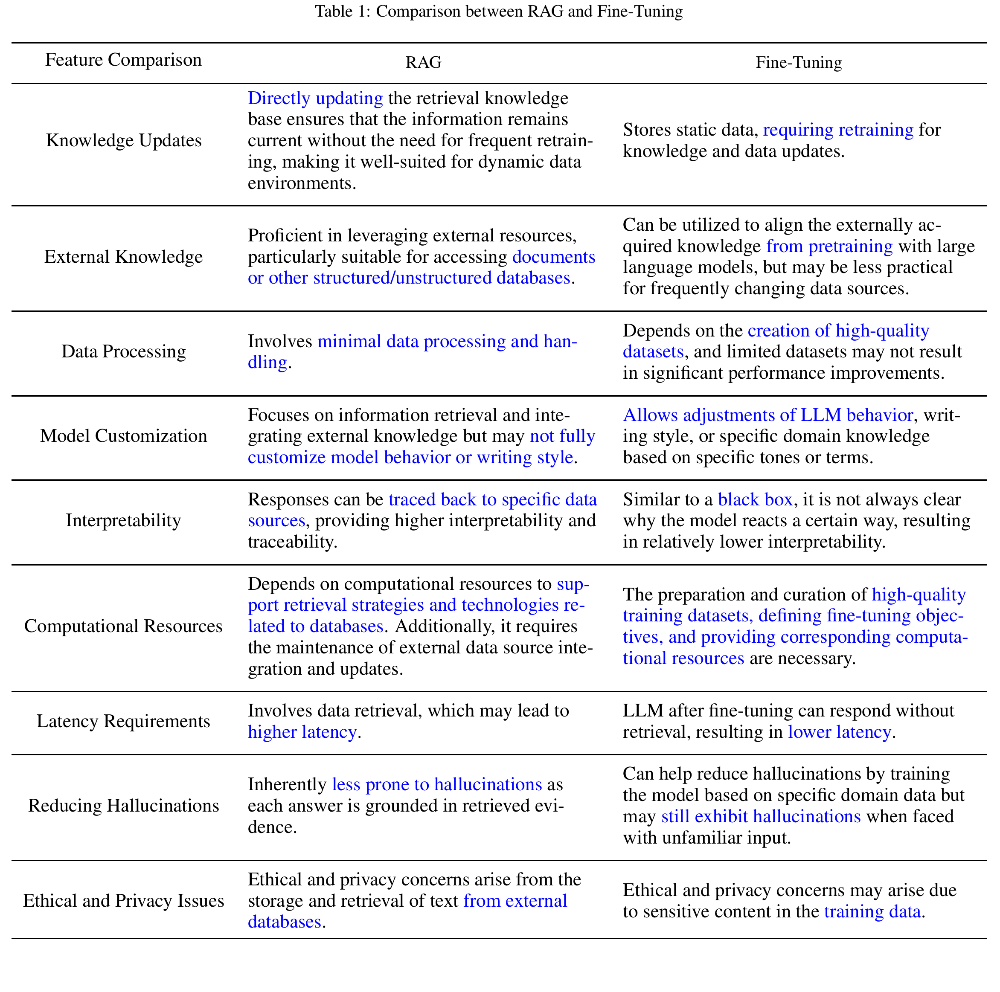
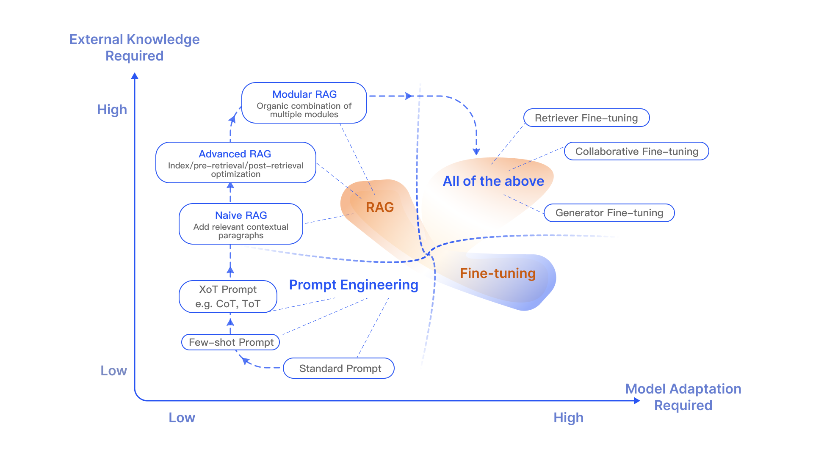
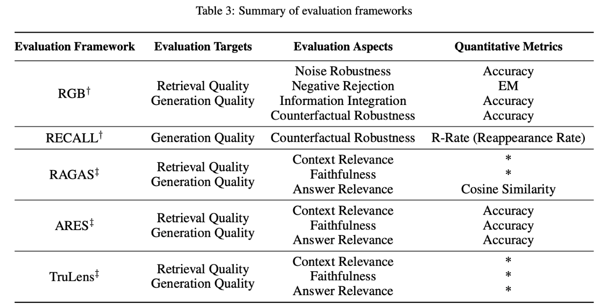

# RAG-Survey

>We are working hard to improve and update, more content will be presented soon. 😊 Stay tuned!

🚀**Our [Slide](assets/RAG_Slide_ENG.pdf) is available now !**

🚀**Check our RAG Survey on Arxiv** (Ongoing update)
**["Retrieval-Augmented Generation for Large Language Models: A Survey"](https://arxiv.org/pdf/2312.10997.pdf)** 
download the latest verison [[Paper]](assets/RAG_Survey.pdf)

If you find our survey useful for your research, please cite the following paper:
```
@misc{gao2024retrievalaugmented,
      title={Retrieval-Augmented Generation for Large Language Models: A Survey}, 
      author={Yunfan Gao and Yun Xiong and Xinyu Gao and Kangxiang Jia and Jinliu Pan and Yuxi Bi and Yi Dai and Jiawei Sun and Qianyu Guo and Meng Wang and Haofen Wang},
      year={2024},
      eprint={2312.10997},
      archivePrefix={arXiv},
      primaryClass={cs.CL}
}
```


<!-- vscode-markdown-toc -->
- [RAG-Survey](#rag-survey)
  - [What is  RAG ?](#what-is--rag-)
  - [Paradigm of RAG](#paradigm-of-rag)
    - [Naive RAG](#naive-rag)
    - [Advanced RAG](#advanced-rag)
    - [Modular RAG](#modular-rag)
  - [How to Do Augementation ?](#how-to-do-augementation-)
  - [RAG or Fine-tuning？](#rag-or-fine-tuning)
  - [How to Evaluate RAG ?](#how-to-evaluate-rag-)
  - [Prospects](#prospects)
    - [Exsting Challenges](#exsting-challenges)
    - [Multimodal Expansion](#multimodal-expansion)
    - [The Ecosystem of RAG](#the-ecosystem-of-rag)
- [RAG Paper List](#rag-paper-list)
  - [Augmentation Stage](#augmentation-stage)
    - [Pre-training](#pre-training)
    - [Fine-tuning](#fine-tuning)
    - [Inference](#inference)
  - [Augmentation Source](#augmentation-source)
    - [Unstructured Data](#unstructured-data)
    - [Structured Data](#structured-data)
    - [LLM Generated Content](#llm-generated-content)
  - [Augmentation Process](#augmentation-process)
    - [Once Retrieval](#once-retrieval)
    - [Iterative Retrieval](#iterative-retrieval)
    - [Recursive Retrieval](#recursive-retrieval)
    - [Adaptive Retrieval](#adaptive-retrieval)
  - [MISC](#misc)
    - [Visualization](#visualization)
  - [Acknowledgments](#acknowledgments)

<!-- vscode-markdown-toc-config
	numbering=false
	autoSave=true
	/vscode-markdown-toc-config -->
<!-- /vscode-markdown-toc -->


## <a name='WhatisRAG'></a>What is  RAG ?

Large language models (LLMs) have become an integral part of our lives and work, transforming how we interact with information through their astonishing versatility and intelligence.

Despite their impressive capabilities, they are not without flaws. These models can produce misleading "**hallucinations**," rely on potentially **outdated information**, be inefficient when dealing with **specific knowledge**, lack depth in **specialized fields**, and fall short in reasoning abilities.

In real-world applications, data needs to be continually updated to reflect the latest developments, and the content generated must be transparent and traceable to manage costs and protect data privacy. Therefore, relying solely on these "**black box**" models is insufficient; we need more refined solutions to meet these complex demands.

In this context, **Retrieval-Augmented Generation (RAG)** has risen to prominence as a groundbreaking trend in the age of artificial intelligence.



>  A typical application of RAG in question-answering. (e.g. Asking chatGPT about the dismissal and rehirement of OpenAI CEO SAM Altman :satisfied: )

RAG significantly improves the precision and pertinence of content by first **retrieve relevant information** from an **external database** of documents prior to the language model's answer generation. 

## <a name='ParadigmofRAG'></a>Paradigm of RAG 

RAG concept, introduced by Lewis in 2020, has rapidly evolved, marking distinct stages in its research journey. Initially, the research aimed to bolster language models by infusing them with additional knowledge during the **pre-training phase**. The launch of ChatGPT sparked a heightened interest in leveraging large models for in-depth contextual understanding, accelerating RAG's development **in inference stage**. As researchers delved deeper into the capabilities of large language models (LLMs), the focus shifted toward enhancing their controllability and reasoning skills to keep pace with growing demands. The advent of GPT-4 marked a significant milestone, revolutionizing RAG with a novel approach that blends it with **fine-tuning techniques** while continuing to refine pre-training strategies.



> Timeline tree of RAG  research

In the technological development of RAG, we summarize its evolution from the perspective of technological paradigms into the following stages:

### <a name='NaiveRAG'></a>Naive RAG

The classic RAG process, also known as Naive RAG, is demonstrated in the previous example. It mainly includes three basic steps:

1. **Indexing** -Splitting the document corpus into shorter chunks and building a vector index through an encoder.
2. **Retrieval** - Retrieving relevant document fragments based on the similarity between the question and the chunks.
3. **Generation** - Generating an answer to the question conditioned on the retrieved context.

### <a name='AdvancedRAG'></a>Advanced RAG

Naive RAG faces multiple challenges in retrieval, generation and augmentation. The Advanced RAG paradigm was subsequently proposed and involves additional processing in **Pre-Retrieval**  and **Post-Retrieval**. Before retrieval, methods such as **query rewriting, routing, and expansion** can be used to align the semantic differences between questions and document chunks. After retrieval, **rerank** the retrieved document corpus can avoid the "Lost in the Middle" phenomenon, or the context can be filtered and **compressed** to shorten the window length.

### <a name='ModularRAG'></a>Modular RAG
With the further development and evolution of RAG technology, new breakthroughs have transcended the traditional Naive RAG **Retrieval-Generation framework**, leading to the concept of Modular RAG. Structurally, it is more free and flexible, introducing more specific functional modules, such as query search engines and the fusion of multiple answers. Technologically, it integrates retrieval with fine-tuning, reinforcement learning, and other techniques. In terms of process, the RAG modules are designed and orchestrated, resulting in various RAG patterns. 

However, Modular RAG did not emerge suddenly; there is a relationship of inheritance and development among the three paradigms. Advanced RAG is a special case of Modular RAG, while Naive RAG is a special case of Advanced RAG.


> Comparsion between three RAG paradigms.


## <a name='HowtoDoAugementation'></a>How to Do Augementation ?

To build a good RAG system, where the augmentation part is key, three critical questions need to be considered: 

1. What to retrieve? 
2. When to retrieve? 
3. How to use the retrieved content?

Starting from the above three questions, we organize the augmentation as follow:

- **Augmentation Stages**. Retrieval augmentation can be performed during the **pre-training**, **fine-tuning**, and **inference** stages, which determines the degree of parameterization of external knowledge and corresponds to different computational resources required.

- **Augmentation Sources**. Augmentation can utilize various forms of data, including **unstructured data** such as text paragraphs, phrases, or individual words. S**tructured data** can also be used, such as indexed documents, triple data, or subgraphs. Another approach is not to rely on external information sources but to fully leverage the intrinsic capabilities of LLMs, retrieving from **content generated by LLMs** themselves.
- **Augementation process**. The initial retrieval was a **once** process, but **iterative** retrieval, **recursive** retrieval, and **adaptive** retrieval methods, where LLMs decide the timing of retrieval on their own, gradually emerged in the development of RAG.



> Technology tree with different augmentation aspects.


> Taxnonomy of RAG's core components

## <a name='RAGorFine-tuning'></a>RAG or Fine-tuning？

In addition to RAG, the main optimization strategies for LLMs also include Prompt Engineering and Fine-tuning (FT). Each has its own unique features. Depending on their reliance on external knowledge and requirements for model adjustment, they each have suitable scenarios.

RAG is like giving the model a textbook for customized information retrieval, which is very suitable for specific queries. On the other hand, FT is like a student internalizing knowledge over time, better suited for mimicking specific structures, styles, or formats. FT can improve the model's performance and efficiency by enhancing the base model's knowledge, adjusting outputs, and teaching complex instructions. However, it is not adept at integrating new knowledge or rapidly iterating new use cases. RAG and FT are not mutually exclusive; they are complementary, and **using them together may yield the best results.**



> RAG vs Fine-tuning quadrantal diagram

## <a name='HowtoEvaluateRAG'></a>How to Evaluate RAG ?

The evaluation methods for RAG are diverse, mainly including three quality scores: **context relevance**, **answer fidelity**, and **answer relevance**. Additionally, the evaluation involves four key capabilities: noise robustness, refusal ability, information integration, and counterfactual robustness. These evaluation dimensions combine traditional quantitative metrics with specialized assessment criteria for RAG's characteristics, although these criteria have not yet been standardized.

In terms of evaluation frameworks, there are benchmarks such as RGB and RECALL, as well as automated evaluation tools like RAGAS, ARES, and TruLens, which help to comprehensively measure the performance of RAG models. 




## <a name='Prospects'></a>Prospects

The development of RAG is burgeoning, and there are several issues worth further investigation. We can look forward to these from three aspects:

### <a name='ExstingChallenges'></a>Exsting Challenges

Aiming to further address the current challenges faced by RAG;

- **Context length.** What to do when the retrieved content is too much and exceeds the window limit? If the context window of LLMs is no longer limited, how should RAG be improved?
- **Robustness**. How to deal with incorrect content retrieved? How to filter and validate the retrieved content? How to enhance the model's resistance to poisoning and noise?
- **Coordination with fine-tuning**. How to leverage the effects of both RAG and FT simultaneously, how should they coordinate, organize, whether in series, alternation, or end-to-end?
- **Scaling Laws**: Does the RAG model satisfy the Scaling Law? Will RAG, or under what scenarios might RAG experience the phenomenon of Inverse Scaling Law?
- **The role of LLMs**. LLMs can be used for retrieval (replacing search with LLMs' generation or searching LLMs' memory), for generation, for evaluation. How to further explore the potential of LLMs in RAG?
- **Production-ready.** How to reduce the retrieval latency of ultra-large-scale corpora? How to ensure that the content retrieved is not leaked by LLMs

### <a name='MultimodalExpansion'></a>Multimodal Expansion 

How can the evolving technologies and concepts of RAG be extended to other modalities of data such as **images, audio, video, or code**? On the one hand, this can enhance tasks within a single modality, and on the other hand, it can fuse multimodalities through the ideas of RAG.

### <a name='TheEcosystemofRAG'></a>The Ecosystem of RAG
The application of RAG is no longer confined to question-answering systems; its influence is expanding into more domains. Now, a variety of tasks such as r**ecommendation systems, information extraction**, and **report generation** are beginning to benefit from the application of RAG technology.

 At the same time, the RAG technology stack is experiencing a boom. In addition to well-known tools like **Langchain** and **LlamaIndex**, the market is seeing an emergence of more targeted RAG tools, for example: those **customized** for specific use cases to meet more focused scenario requirements; those **simplified** for use to further lower the barrier to entry; and those specialized in functionality, gradually aiming towards **production environments.**


# RAG Paper List

## <a name='AugmentationStage'></a>Augmentation Stage

### <a name='Pre-training'></a>Pre-training
1.Improving language models by retrieving from trillions of tokens  [[paper]](https://markdown.com.cn)[[code]](https://markdown.com.cn)

2.Few-shot Learning with Re-trieval Augmented Language Models [[paper]](https://arxiv.org/pdf/2208.03299.pdf)

3.Toolformer: Language Models Can Teach Themselves to Use Tools[[paper]](https://arxiv.org/abs/2302.04761)

4.Copy is all you need[[paper]](https://openreview.net/pdf?id=CROlOA9Nd8C)

5.In-context learning with retrieval augmented encoder-decoder language model[[paper]](https://arxiv.org/abs/2308.07922)

6.Shall we pretrain autoregressive language models with retrieval?[[paper]](https://arxiv.org/abs/2304.06762)

7.Demonstrate-Search-Predict: Composing retrieval and language models for knowledge-intensive NLP[[paper]](https://arxiv.org/abs/2212.14024)

### <a name='Fine-tuning'></a>Fine-tuning
1.Dense Passage Retrieval for Open-Domain Question Answering[[paper]](https://arxiv.org/abs/2004.04906)

2.UPRISE: Universal Prompt Retrieval for Improving Zero-Shot Evaluation[[paper]](https://arxiv.org/abs/2303.08518)[[code]](https://github.com/microsoft/LMOps)

3.Distilling knowledge from reader to retriever for question answering[[paper]](https://arxiv.org/abs/2012.04584)

4.RA-DIT: Retrieval-Augmented Dual Instruction Tuning[[paper]](https://arxiv.org/abs/2310.01352)

5.Self-RAG: Learning to Retrieve, Generate, and Critique through Self-Reflection[[paper]](https://arxiv.org/abs/2310.11511)

6.Knowledge Graph-Augmented Language Models for Knowledge-Grounded Dialogue Generation[[paper]](https://arxiv.org/abs/2305.18846)

7.Structure-Aware Language Model Pretraining Improves Dense Retrieval on Structured Data [[paper]](https://aclanthology.org/2023.findings-acl.734.pdf) [[code]](https://github.com/OpenMatch/SANTA)

8.Replug: Retrieval-augmented black-box language models [[paper]](https://arxiv.org/pdf/2301.12652.pdf)

9.Augmentation-Adapted Retriever Improves Generalization of Language 
Models as Generic Plug-In [[paper]](https://arxiv.org/abs/2305.17331)[[code]](https://github.com/OpenMatch/Augmentation-Adapted-Retriever)


### <a name='Inference'></a>Inference
1.Generalization through Memorization: Nearest Neighbor Language Models[[paper]](https://arxiv.org/abs/1911.00172)

2.DEMONSTRATE–SEARCH–PREDICT: 
Composing retrieval and language models for knowledge-intensive NLP  [[paper]](https://arxiv.org/abs/2212.14024)[[code]](https://github.com/stanfordnlp/dspy)

3.Keyword Augmented Retrieval: Novel framework for Information Retrieval integrated with speech interface. [[paper]](https://arxiv.org/abs/2310.04205)

4.Interleaving retrieval with chain-of-thought reasoning for knowledge-intensive multi-step questions. [[paper]](https://arxiv.org/pdf/2212.10509.pdf)[[code]](https://github.com/stonybrooknlp/ircot)

5.Generate rather than Retrieve: Large Language Models are Strong Context Generators [[paper]](https://arxiv.org/abs/2209.10063) [[code]](https://github.com/wyu97/GenRead)

6.In-Context Retrieval-Augmented Language Models [[paper]](https://arxiv.org/abs/2302.00083)

## <a name='AugmentationSource'></a>Augmentation Source


### <a name='UnstructuredData'></a>Unstructured Data
1.UPRISE: Universal Prompt Retrieval for Improving Zero-Shot Evaluation[[paper]](https://arxiv.org/abs/2303.08518)[[code]](https://github.com/microsoft/LMOps)

2.From Classification to Generation: Insights into Crosslingual Retrieval Augmented ICL [[paper]](https://arxiv.org/abs/2311.06595)

3.Copy is all you need [[paper]](https://openreview.net/pdf?id=CROlOA9Nd8C)

### <a name='StructuredData'></a>Structured Data
1.FABULA: Intelligence Report Generation Using Retrieval-Augmented Narrative Construction [[paper]](https://arxiv.org/abs/2310.13848)

2.Knowledge Graph-Augmented Language Models for Knowledge-Grounded Dialogue Generation [[paper]](https://arxiv.org/abs/2305.18846)

3.KnowledGPT: Enhancing Large Language Models with Retrieval and Storage Access on Knowledge Bases [[paper]](https://arxiv.org/abs/2308.11761)

4.Graph-ToolFormer: To Empower LLMs with Graph Reasoning Ability via Prompt Augmented by ChatGPT [[paper]](https://arxiv.org/abs/2304.11116)

### <a name='LLMGeneratedContent'></a>LLM Generated Content
1.Lift Yourself Up: Retrieval-augmented Text Generation with Self-Memory [[paper]](https://arxiv.org/abs/2305.02437)

2.DEMONSTRATE–SEARCH–PREDICT: 
Composing retrieval and language models for knowledge-intensive NLP [[paper]](https://arxiv.org/abs/2212.14024)

3.Recitation-augmented language models[[paper]](https://arxiv.org/pdf/2210.01296.pdf)

4.Generate rather than Retrieve: Large Language Models are Strong Context Generators [[paper]](https://arxiv.org/abs/2209.10063)

5.Self-Knowledge Guided Retrieval Augmentation for Large Language Models [[paper]](https://arxiv.org/abs/2310.05002)


## <a name='AugmentationProcess'></a>Augmentation Process


### <a name='OnceRetrieval'></a>Once Retrieval
1.Retrieval-augmented generation for knowledge-intensive nlp tasks [[paper]](https://proceedings.neurips.cc/paper/2020/hash/6b493230205f780e1bc26945df7481e5-Abstract.html)

2.UPRISE: Universal Prompt Retrieval for Improving Zero-Shot Evaluation [[paper]](https://arxiv.org/abs/2303.08518)

3.Augmented Large Language Models with Parametric Knowledge Guiding [[paper]](https://arxiv.org/abs/2305.04757)

4.Learning to Retrieve In-Context Examples for Large Language Models.[[paper]](https://arxiv.org/pdf/2307.07164.pdf)

5.Few-shot Learning with Re-trieval Augmented Language Models [[paper]](https://arxiv.org/pdf/2208.03299.pdf)
6.Replug: Retrieval-augmented black-box language models [[paper]](https://arxiv.org/pdf/2301.12652.pdf)

7.Recitation-augmented language models[[paper]](https://arxiv.org/pdf/2210.01296.pdf)


### <a name='IterativeRetrieval'></a>Iterative Retrieval 
1.DEMONSTRATE–SEARCH–PREDICT: 
Composing retrieval and language models for knowledge-intensive NLP [[paper]](https://arxiv.org/abs/2212.14024)[[code]](https://github.com/stanfordnlp/dspy)

2.Retrieve-and-Sample: Document-level Event Argument Extraction via Hybrid Retrieval Augmentation [[paper]](https://aclanthology.org/2023.acl-long.17/)

3.Enhancing Retrieval-Augmented Large Language Models with Iterative Retrieval-Generation Synergy[[paper]](https://arxiv.org/abs/2305.15294)

4.RETRIEVAL-GENERATION SYNERGY AUGMENTED LARGE LANGUAGE MODELS [[paper]](https://arxiv.org/abs/2310.05149)

### <a name='RecursiveRetrieval'></a>Recursive Retrieval
1.Interleaving Retrieval with Chain-of-Thought Reasoning for Knowledge-Intensive Multi-Step Questions [[paper]](https://arxiv.org/abs/2212.10509)[[code]](https://github.com/stonybrooknlp/ircot)

2.Tree of Clarifications: Answering Ambiguous Questions with Retrieval-Augmented Large Language Models [[paper]](https://arxiv.org/abs/2310.14696)

### <a name='AdaptiveRetrieval'></a>Adaptive Retrieval
1.Active Retrieval Augmented Generation[[paper]](https://arxiv.org/abs/2305.06983)[[code]](https://github.com/jzbjyb/FLARE)

2.Self-RAG: Learning to Retrieve, Generate, and Critique through Self-Reflection [[paper]](https://arxiv.org/abs/2310.11511)

3.In-context learning with retrieval augmented encoder-decoder language model [[paper]](https://arxiv.org/abs/2308.07922)


## <a name='MISC'></a>MISC

### <a name='Visualization'></a>Visualization

We're incredibly thankful for the warm reception and positive feedback we've received regarding the figures in the survey. It's always a pleasure to share insights from our corner of the data visualization world.

Our go-to tool for creating these visuals is [Figma](https://www.figma.com/). We're currently in the midst of refining our charts, ensuring they are as informative and user-friendly as possible.

With an eye toward the future and a commitment to the spirit of collaboration, we're also exploring the possibility of releasing our chart templates as open-source template in Figma. Keep an eye on the repo for updates on this exciting initiative


## <a name='Acknowledgments'></a>Acknowledgments


We would like to extend our deepest gratitude to the following authors and researchers. Their exceptional contributions in the field of RAG, along with their willingness to share their findings, have been truly commendable.Without their insightful research, invaluable experience, and generous sharing, we would not have been able to present the material associated with RAG as extensively in our survey. We reiterate our profound appreciation to all the researchers, industry professionals, and knowledge sharers. Additionally, we extend our thanks to everyone who has provided us with invaluable insights.


